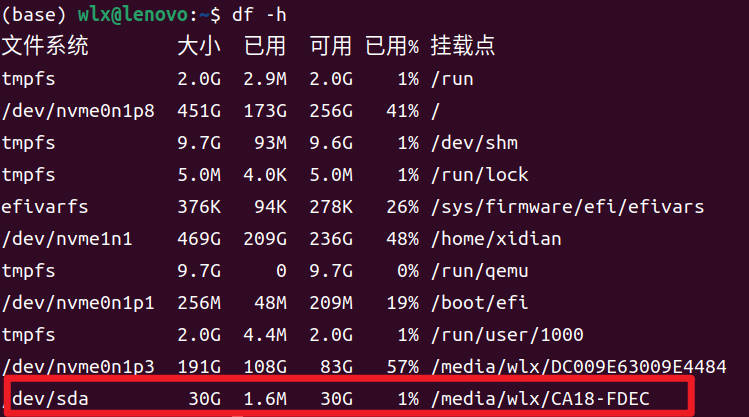
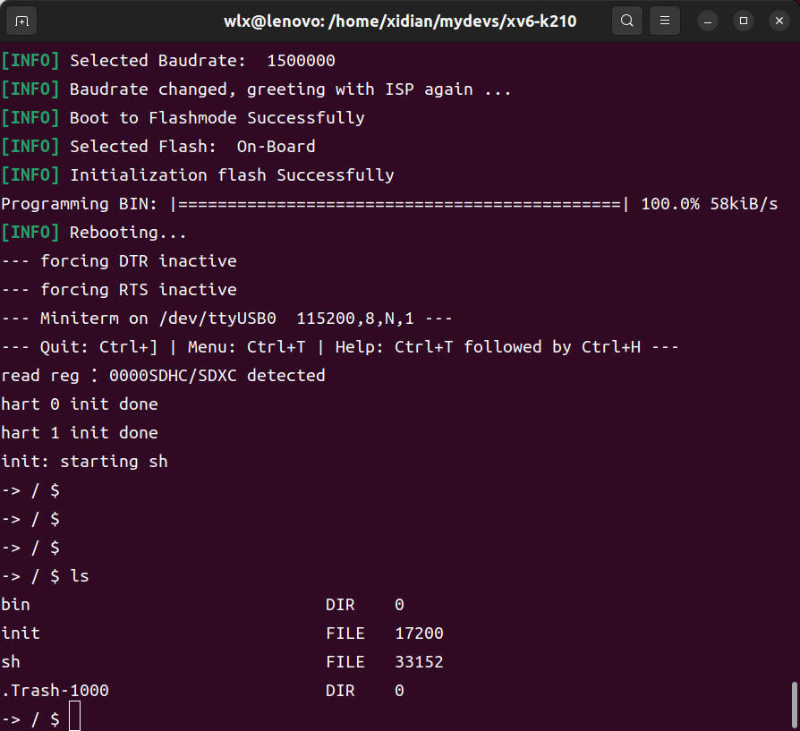

# 项目介绍
## 概要
- [xv6-k210](https://github.com/HUST-OS/xv6-k210 ) 项目是几位大佬完成的，此项目将 xv6 操作系统移植到基于 RISC-V 架构的 K210 芯片上，感谢该仓库的各位大佬完成的大量工作
- 本项目基于[xv6-k210](https://github.com/HUST-OS/xv6-k210 ) ，对该仓库的代码进行阅读和源码注释，并尝试进行一些修改
## 动机
- xv6 操作系统是在 qemu 模拟器上运行的，系统运行在电脑终端上。在学习完成后，想要尝试自己移植到实际的芯片上运行，通过网络搜索很快找到了[xv6-k210](https://github.com/HUST-OS/xv6-k210 ) 仓库，恰巧以前竞赛的时候使用过 K210 ，当时是通过 MicroPython 在 K210 上运行 YOLOv2，对该芯片也有一定的了解，所以就决定行动起来
## 硬件准备
- Sipeed Maix Bit 开发板
- 一张 SD 卡 + 读卡器
- Sipeed RV debugger plus 调试器（可选）

# 程序启动
1. 格式化 SD 卡
- 在原作者移植的 xv6-k210 中，将文件系统修改为 FAT32，并将数据存储在 SD 卡中，但是文件系统不支持分区，因此需要格式化 SD 卡，并且不进行分区
- 首先将 SD 卡通过读卡器查到 Ubuntu 的电脑上，通过 df -h 查看设备名称，下图为`/dev/sda`

- 对 SD 卡进行格式化
```bash
sudo umount /dev/sda
sudo mkfs.fat -F32 /dev/sda
```


2. 安装一些工具包
```bash
sudo apt update
sudo apt install build-essential pkg-config  autoconf libtool libssl-dev flex bison ninja-build libglib2.0-dev libpixman-1-dev libslirp-dev libncurses5-dev libncursesw5-dev git build-essential gdb-multiarch qemu-system-misc gcc-riscv64-linux-gnu binutils-riscv64-linux-gnu gcc-riscv64-unknown-elf
```

3. 下载代码，编译并将用户态程序拷贝到 SD 卡中
```bash
git clone https://github.com/wanglinxiao123/xv6-k210.git
cd xv6-k210
# 更改为实际的挂载路径
export SD_DST=/media/wlx/0F62-5AA5
# 该命令编译用户态程序，并拷贝到 SD 卡中
make sdcard
```

4. 将 SD 卡插入开发板中，并将 K210 开发板插入电脑中，查看系统为该串口生成的字符文件，修改`makefie`中的`k210-serialport`变量，通过`make run`烧录程序
```bash
ls /dev | grep ttyUSB
# 修改 makefile 中的 k210-serialport 为实际端口，如/dev/ttyUSB0
make run
```

5. 大功告成，我们的程序跑起来了！
